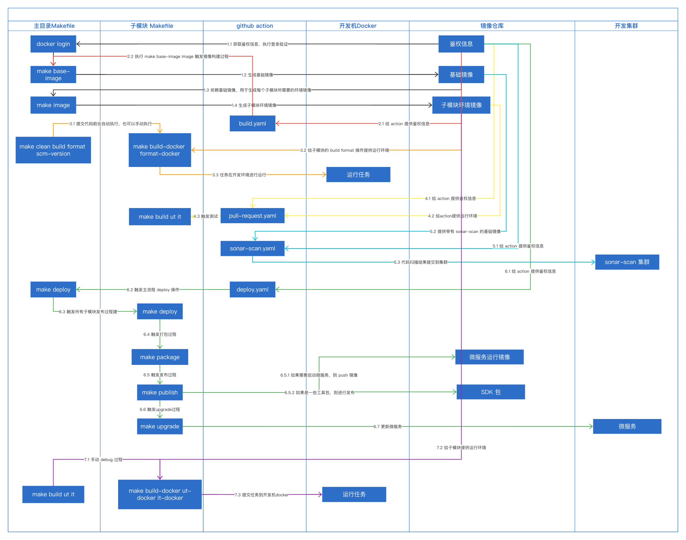

## prepare

1. [Authenticating to the Container registry](https://docs.github.com/en/packages/working-with-a-github-packages-registry/working-with-the-container-registry#authenticating-to-the-container-registry) # this is for image push to github package, please add your own secreat key in your repo.
2. `pip3 install ruamel.yaml # this is for python script, please install it on your machine.`
3. `./bin/init.sh  # this is for githook, pre-commit script and pre-push script will be trigged when you have git commit or git push on terminal.`
4. `make local-start-mysql # if you had start mysql on 3306 port before, please stop it.`

## local debug

1. `make local-start-mysql`

## CICD 流程图

