# etcd

## etcd 是什么？
> etcd 是一个键值型高一致性分布式存储

## etcd 能做什么？
> 使用http协议完成读写
> 
> 键值存储
> 
> 监听键值变化

## etcd 如何工作？

### 数据模型
> etcd 将数据存储在一个多版本的持久化键值存储系统中，键值对一旦提交就不能更改；
> 随着时间的推演，占用的存储空间会越来越大，这时，etcd会通过压缩历史数据来去除掉一部分老数据，减轻存储压力
> 
> 使用扁平的二进制作为key的存储结构，key 的本身已经排序，range 查询开销不高；
> key值空间包含版本信息，版本信息也会加入到排序中，新建的 key 版本为 1，如果删除key，会将版本置为0
> 
> 物理上etcd将键值以B+树的结构存储起来，所有的修改只存储当前版本和前一个版本的差值
> 
> etcd的内存使用B树进行存储

### etcd client 的设计模式
> 负载均衡
> 
> 使用 API 发送 RPCs 到 etcd 服务
> 
> 错误处理、错误重试和节点切换

### etcd learner 设计

#### 背景描述
集群的成员管理存在以下问题

1. 新加入的节点同步大量数据，导致 leader overload
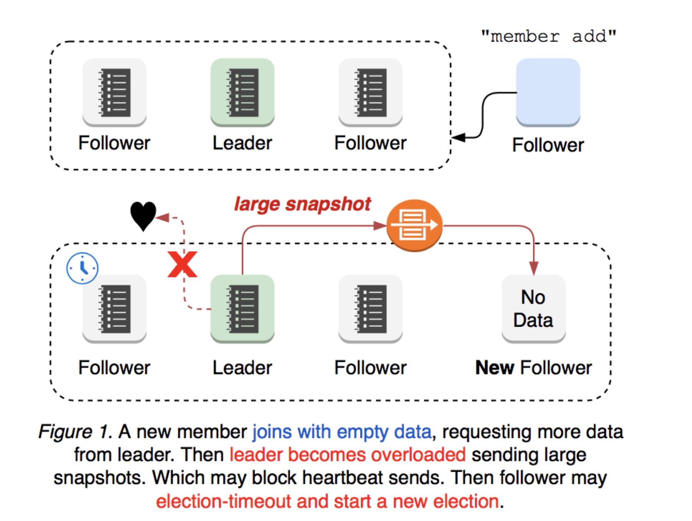
2. 网络中断
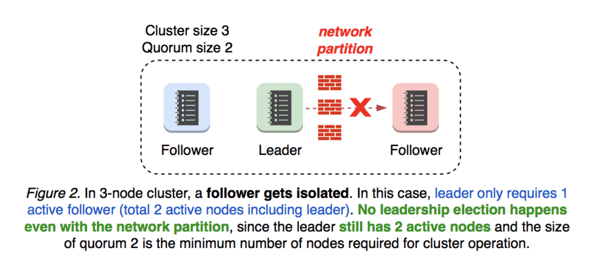
3. leader 被隔离，这个时候重新选举 leader
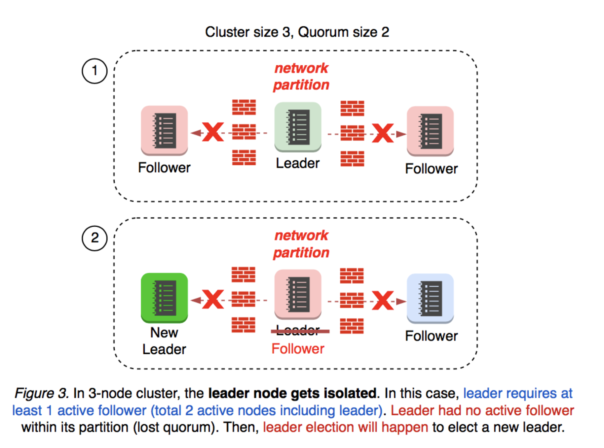
4. 加入新节点时发生不均衡分裂，如果新加节点在 leader 所在的部分，则没有影响
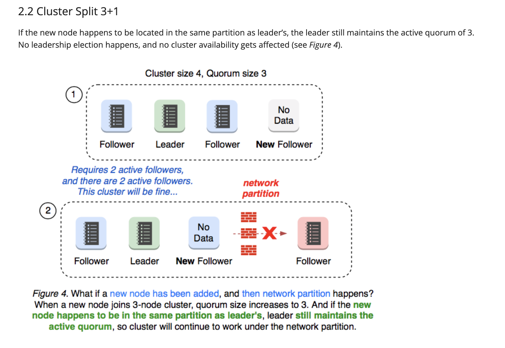
5. 加入新节点时发生均衡分裂，如果新节点不在leader所在的部分，则新节点不加入集群
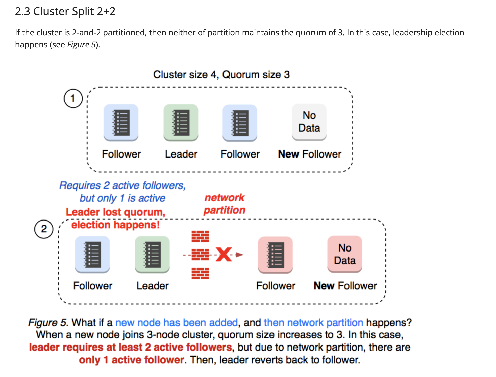
6. 如果一个集群只有三个节点，在加入新节点之前已经失去了一个节点，那么加入新节点之后，
会进行 leader 选举
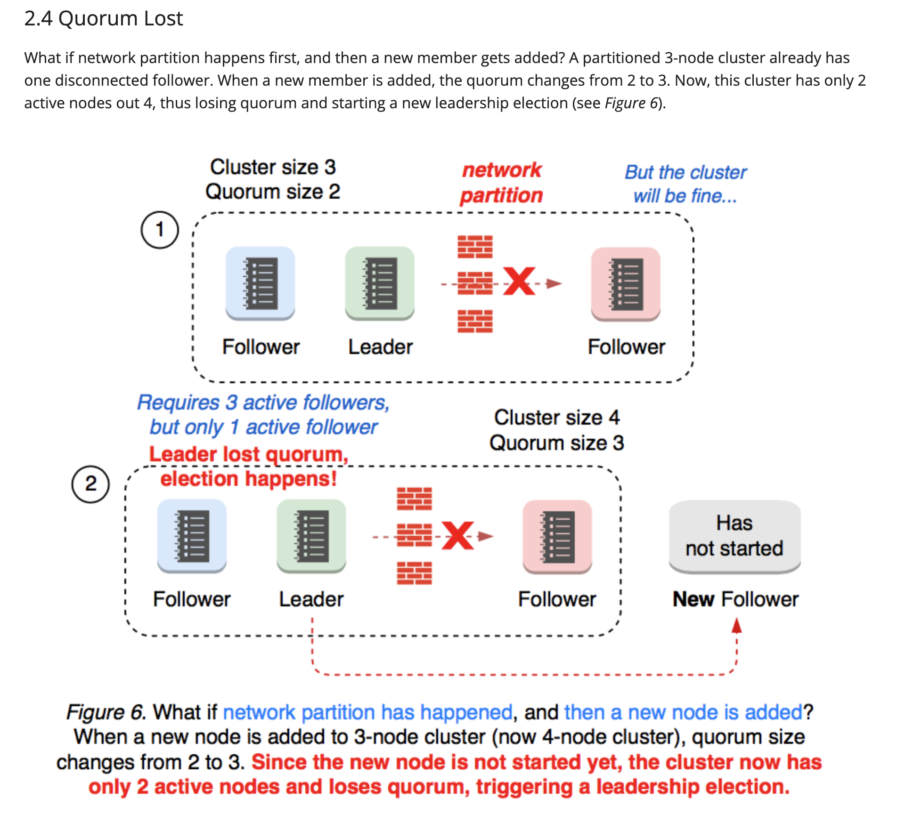
节点数变化通常会发生选举，所以在增加节点之间，建议先删除不健康的节点
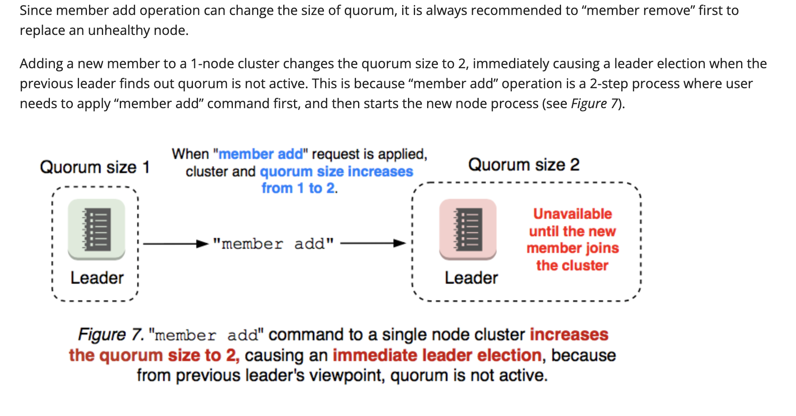
7. 集群配置出错
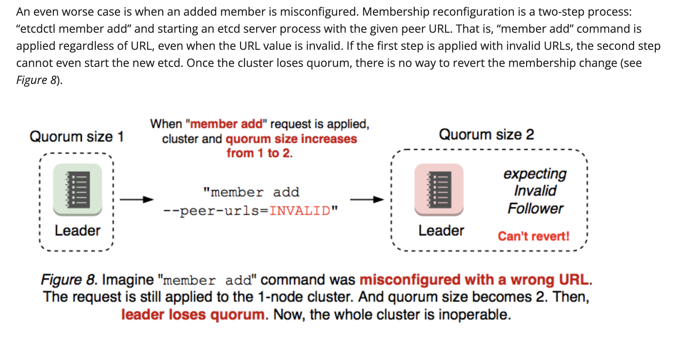
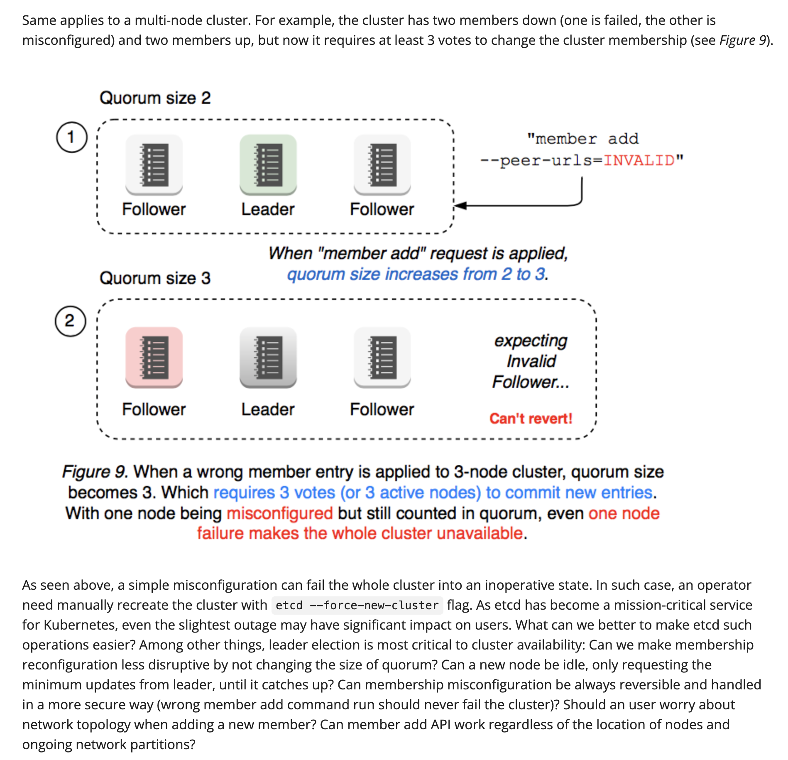

#### Raft Learner
1. 加入新的 learner 时，以没有投票权限的方式加入，同时接收所有来自 leader 的数据
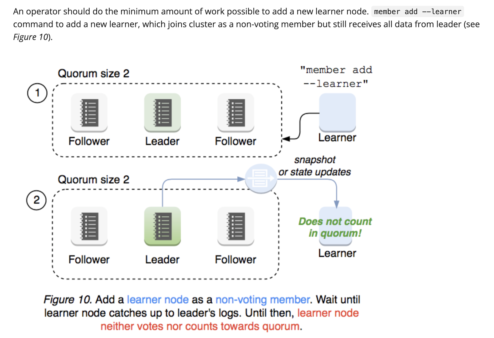
2. 数据同步完成之后，给新 learner 添加投票权限
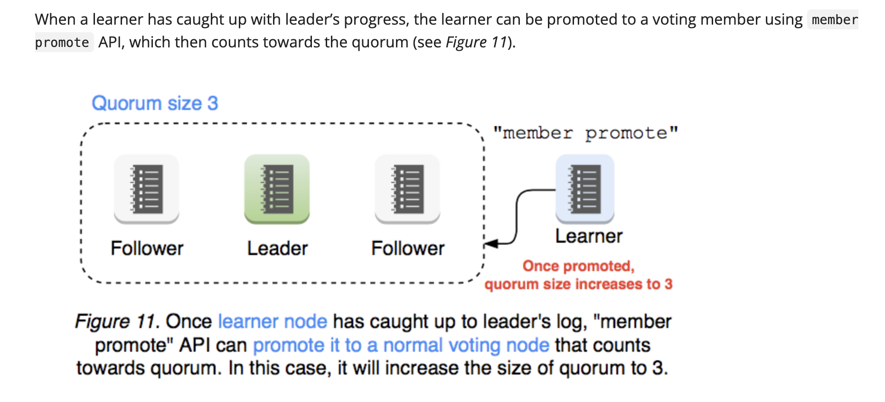
3. leader 确认 learner 的投票权限
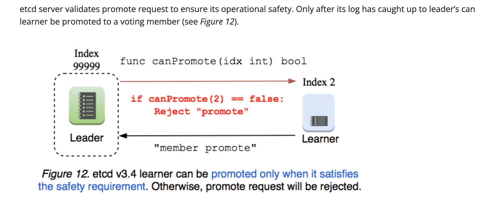
4. learner 在获得投票权之前不接受请求
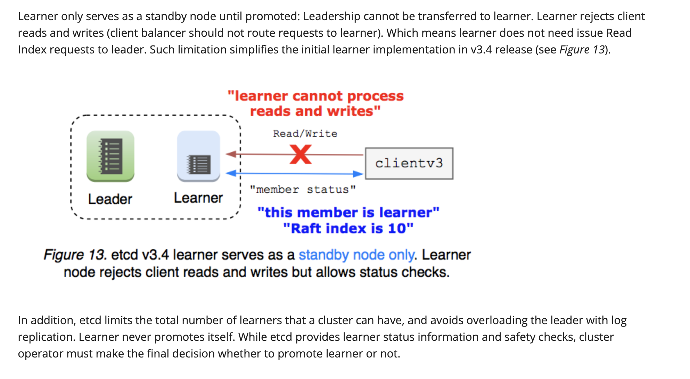

## etcd 优势在哪？
> 简单：基于 HTTP+JSON 的 API 让你用 curl 就可以轻松使用
> 
> 安全：可选 SSL 客户认证机制
> 
> 快速：每个实例每秒支持一千次写操作
> 
> 可信：使用 Raft 算法充分实现了分布式
