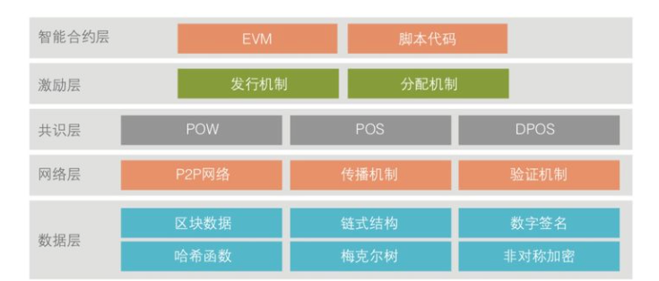

# 以太坊自问自答



## 智能合约

Q: 智能合约的漏洞有哪些？
> 重入（或者说重放攻击）
> 
> 整数溢出
> 
> 未处理的异常
> 
> 拒绝服务
> 
> 随机数
> 
> 交易顺序依赖
> 
> 时间戳依赖
> 
> 短地址

Q：智能合约漏洞检测方法有哪些？
> 静态程序分析：通过分析程序的静态特征来检测安全漏洞
> 
>> 符号执行：分析程序的每一条执行路径，为每条路径计算按此路径执行需要满足的条件，并通过约束求解器求解这一条件；
>> Qyente 分析工具支持检测重入、交易顺序依赖和时间戳依赖4种安全漏洞
>>
>> 语义分析：分析智能合约并提取其语义特征（如数据流依赖和控制流依赖等），并根据一定的规则来分析语义特征，以判断是否存在安全漏洞；
>> Securify 工具以智能合约字节码为输入，通过智能合约的依赖图来进行分析，通过规则的模式匹配来发现漏洞；
>> Securify 的提取规则是通过逻辑语言Datalog定义的，并使用了现有的Datalog引擎进行求解
> 
> 动态程序分析：通过观察程序在不同数据下运行的行为来判断是否存在安全漏洞
> 
>> 模糊测试：通过构造大量的输入数据，并监测智能合约的执行过程来发现智能合约中的安全漏洞；
>> ContractFuzzer 工具首先分析智能合约中所有函数，对于没有提供ABI的智能合约则分析其所有外部函数，之后通过利用智能合约的ABI生成输入数据，利用EVM记录的运行轨迹进行漏洞分析；
>> ContractFuzzer 中定义了7种测试原语，支持对多种安全漏洞的监测，对于合约相互调用产生的重入问题构造AttackAgent合约，利用其回退函数来完成重入的检测；
>> 在模糊测试中，常常存在输入数据量为指数级和代码覆盖率低等问题
>>
>> 动态污点分析：将输入数据标记为污点，在智能合约运行的过程中传播污点并对其进行分析;
>> 污点分析关注输入参数的行为，通过最终污点的传播路径，判断路径上是否可能出现安全漏洞；
>> EasyFlow是基于动态污点分析判断以太坊智能合约中是否存在整数溢出的方法，EasyFlow还对SafeMath及其可能的变种进行了识别，有效降低了误报率
>>
>> 形式化方法：通过设置一定的公理，建立特定的逻辑推理系统，对代码进行逻辑推理证明，可以验证智能合约的正确性；其复杂的证明过程使得形式化方法难以用于逻辑复杂的大型程序
>>
>> `Solidity*和EVM*是通过对以太坊智能合约进行形式化验证的工具`
> 
> 目前仍存在单一工具覆盖漏洞种类少、漏报误报率高、代码覆盖率低、检测效率低等诸多问题

## 激励层

Q: 什么是重放攻击？
> 重放攻击指的是利用网络监听或者其他方式盗取API请求，进行一定处理后，再把它重新发给认证服务器

## 共识层

Q: 什么是 PoS 算法？
> PoS(Proof of Stake)，共识算法的一种。作为另一种共识算法（PoW，Proof of work）的接班者，以太坊计划使用叫做"Casper"的PoS算法来替换 PoW
>
> PoS算法的运作流程大体如下：
>
>> 区块链会跟踪一组验证者，而任何持有区块链原生密码学货币（在以太坊中就是以太币）的人都可以称为验证者，只需发送一笔特殊的交易把自己的以太币作为保证金锁住就好
>>
>> 验证者轮流提议下一个区块并对之投票，每一位验证者投票的权重都与他们质押的保证金（即权益）大小正相关，同时承担他们所投票支持的区块被大多数验证者拒绝所导致的风险
>>
>> 如果验证者投票支持的区块被大多数验证者接受，该验证者就能获得一笔与质押成正比的奖励
>>
>> 因此，PoS通过系统的奖励和惩罚让验证者遵守共识规则、诚实地行动
>>
>> PoS与PoW主要的区别在于PoS中的惩罚是内生于区块链的（例如失去质押的以太币），而PoW的惩罚是外生的（例如让花在电力上的资金做了无用功）

## 网络层

## 数据层

Q: 什么是区块链？
> 在以太坊网络中，由工作证明验证的区块序列
> 
> 其包含着实时、不可变更的交易和所有权记录
> 
> 本质上来说就是一个去中心化的账本和数据库

Q: 什么是以太坊？
> 以太坊是一个具备确定性当实际上却没有边际的状态机
> 
> 是一个开源的、全球去中心化的计算基础架构
> 
> 是一个可以执行智能合约功能的公共区块链平台

Q: 区块链的组件有哪些？以太坊相对应的组件是什么？

| 区块链组件 | 以太坊组件 |
| ---- | ---- |
| 一个连接参与各方的点对点网络，用于传播交易和区块数据包，给予标准的"gossip"协议 | Ethereum Main Network, 这是一个通过 TCP 30303端口寻址的网络 |
| 以交易形式体现的消息，代表状态的转换  | 以太坊交易是一个网络消息，主要包含交易的发送方、接收方、价值和数据载荷 |
| 一组共识规则，用于管理构成交易的内容以及实现有效的状态转换 | 由以太坊黄皮书中的参考标准进行精确定义 |
| 一个状态机，根据共识规则处理交易 | 以太坊虚拟机（EVM），这是一个基于栈的虚拟机，执行 bytecode，EVM程序采用高级语言编写 |
| 一组串联在一起的、由加密算法保证其安全的区块，这些区块是所有已验证和已接受的状态转换的记录日志 | 以数据库（通常采用Google的LevelDB）的方式保存在每一个节点上，区块链内包含了交易和系统的状态，经过哈希处理的数据保存在Merkle Patricia Tree 数据结构之内 |
| 一个共识算法，用于在区块链上实现控制的去中心化，这类算法通过强制参与者之间的合作以实现共识规则的有效执行 | 使用比特币的共识模型Nakamoto Consensus，它使用顺序单一的签名块，由 PoW 加权重要性来确定最长链，从而确定当前的状态 |
| 在博弈论上合理的激励方案（如工作量证明、区块奖励），以在开放环境中经济地保护状态机 | 使用 Ethash 的工作量证明算法，迟早要切换到 PoS |
| 上述一个或多个开源软件实现 | Go-Ethereum、Parity | 

Q：什么是代币？
> 基于区块链的代币是指基于区块链的一种抽象资产，可以被持有并用来代表资产、现金或访问权限

## 算法

Q: 什么是函数式编程？
```
In computer science, functional programming is a programming paradigm where programs are constructed by applying and composing functions. It is a declarative programming paradigm in which function definitions are trees of expressions that map values to other values, rather than a sequence of imperative statements which update the running state of the program
```
> 在计算机科学中，函数式编程指的是遵循函数式范式来进行编程的过程
> 
> 该范式的中心思想是，使用简单的函数组合来实现复杂的实现过程
> 
> 而这简单的函数组合，会将原始输入映射到输出，从而获得结果，而不是直接改变输入
> 
> 整体而言，函数式编程在这个过程中不应该有数据修改，那么整个过程就不会产生副作用

Q：如何确定正在使用哪个哈希算法？
> 采用测试矢量来确定
> 
> 给定一个特定的字符串，比如 ""
> 
> 喂入正在使用的程序中，观察给出的 hash 值
> 
> 判断该值应该和已知的哈希函数（比如 SHA-3 或 Keccak-256）的返回值是否一致，从而得知是哪个哈希算法

Q：BIP-39 可选密码是什么？
> 该标准允许用户在生成种子密钥的过程中使用可选密码
> 
> 如果用户没有设定可选密码，默认使用字符串"mnemonic"进行助记词的密钥扩展运算，生成一个特定的512比特的种子密钥
> 
> 如果用户设定了密码，那么对于同样的助记词，密钥扩展运算会生成完全不同的种子密钥
> 
> 实际上，给定一组助记词，每一个密码都会导致不同的种子密钥，特别是这里没有正确或错误的密码，所有密码都可以生成用来衍生无数钱包地址的种子密钥
> 
> 可选密码带来两个重要功能：1、作为助记词的第二道防线，助记词泄露的情况下，保护种子密钥；2、作为"干扰"钱包，密码指向的钱包只包含小额资金，用来把攻击者的注意力从真正包含大量资金的钱包上引开
> 
> 可选密码也有缺点，如果钱包的所有人意外去世，只有助记词是无法获得钱包中的数字资产的；如果将助记词和可选密码保存在一起，又使得可选密码失去第二道防线的意义

Q：什么是图灵完备性？
> 在可计算性理论里，如果一系列操作数据的规则（如指令集、编程语言、细胞自动机）可以用来模拟单带图灵机，那么它是图灵完备的
> 
> 单带图灵机是一个数学模型，由图灵提出，它是一个架空的想法，图灵证明了：只要图灵机可以被实现，就可以用来解决任何可计算问题
> 
> 图灵机的结构包括：
>
>> 一条无限长的纸带，纸带上每个格子都可以写上至多一个字符（无限输入）
>>
>> 一个字符表（单个输入的所有可能性枚举集合）
>>
>> 一个读写头，可以读取纸带上的输入
>>
>> 一个状态寄存器，它追踪着每一步运算过程中，整个机器所处的状态（运行/终止）；当这个状态从运行变为终止，则运算结束，机器停机并交回控制权，它对应着有限状态机里的状态
>>
>> 一个有限的指令集，它记录着读写头在特定的状态下需要执行的行为（对应计算机程序）
