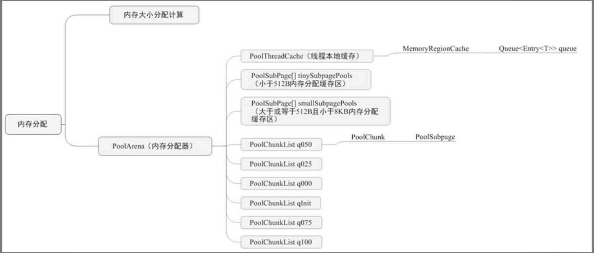

# Netty 小白入门

> Q: Netty 是什么？
>
> A: Netty 是一款流行的 Java NIO 框架
> 
> Q: 什么是 NIO？
> 
> A: NIO 是 Non-blocking I/O 的简称，即一种同步非阻塞I/O模型；
> NIO一个重要的特点是：socket主要的读、写、注册和接收函数，在等待就绪阶段都是非阻塞的，真正的I/O操作是同步阻塞的（消耗CPU但性能非常高）

## 构建 Netty 服务端的步骤
> 1. 创建两个线程组：Boss 和 Worker，Boss 用于接收客户端请求，Worker 用于处理接收到的连接
> 
> 2. 应用服务启动辅助类ServerBootstrap创建一个对象，并配置一系列相关参数
> 
> 3. 当 Boss 线程把接收到的连接注册到Worker线程中后，需要提交给连接初始化消息处理Handler链
> 
> 4. 编写业务处理Handler链，并实现对接收客户端消息的处理逻辑
> 
> 5. 绑定端口

## 多路复用器

NIO有一个非常重要的组件-多路复用器，其底层有三种经典模型，分别是epoll、select和poll。

与传统I/O相比，一个多路复用器可以处理多个Socket连接，而传统I/O对每个Socket连接都需要一条线程同步阻塞处理。

NIO有了多路复用器后，只需要一条线程即可管理多个Socket连接的接入和读写事件。

Netty的多路复用器默认调用的模型是epoll模型。

### NIO vs BIO
> BIO：客户端向服务端发送10B的数据库，若服务端一次只能接收到8B的数据，则必须一直等到后面的2B数据到来，线程才会继续，否则会一只阻塞在接收函数处
> 
> NIO：同样的场景下，线程会从接收函数处返回，然后从处理其他channel的读写操作，等另外2B数据到达之后再去读取

### epoll vs select
> select 模型有三个特点：
> 
>> select 只有一个select函数，每次在调用select函数时，都需要把整个文件描述符集合从用户态拷贝到内核态，当文件描述符很多时，浪费性能
>> 
>> 每次调用select函数时，内核都需要遍历所有的文件描述符，这个开销也大
>>
>> select可支持的文件描述符有上限，可监控的文件描述符个数等于于sizeOf(fd_set)*8
> 
> epoll模型有三个函数：
> 
>> epoll_create 用于创建句柄
>>
>> epoll_ctl 
>>
>> epoll_wait 等待文件描述符就绪

## 序列化

### Protobuf 缺点
> 从 Protobuf 序列化后的数据中发现，Protobuf 序列化不会把 Java 类序列化进去，当遇到对象的一个属性是泛型且有继承的情况时，Protobuf 序列化
> 无法正确对其进行反序列化，还原子类信息
> 
> Protobuf需要编写 .proto 文件，比较麻烦；Protostuff 是 Protobuf 的升级版，只需要在对象属性上加入 @Tag 注解即可
> 
> 可读性差，只能通过程序反序列化解析查看具体内容

### Kryo 序列化 -- 快速高效的图形化序列化框架

## 零拷贝
零拷贝是Netty的一个特性，主要体现在操作数据时，无须将数据Buffer从一个内存区域拷贝到另一个内存区域，少一次拷贝，让CPU效率提升

### 零拷贝场景
> Netty接收和发送ByteBuffer采用的都是堆外直接内存，使用堆外直接内存进行Socket的读/写，无须进行字节缓冲区的二次拷贝
> 
> 在网络传输中，Netty通过组合内存的方式把内存数据包逻辑组合到一块，CompositeByteBuf 在这种场景下使用到
> 
> 传统拷贝文件的方法需要先把文件采用FileInputStream文件输入流读取到一位临时的byte[]数组中，然后通过FileOutputStream文件输出流，把临时的byte[]
> 数据内容写入目的文件中。Netty底层运用Java NIO的FileChannel.transfer()方法，依赖操作系统的具体实现，直接将文件缓冲区的数据发送到目标Channel
> 中，避免了传统的通过循环写方式导致的内存数据拷贝问题

## 背压
当消费者的消费速率低于生产者的发送速率时，会造成背压

### TCP 窗口
Netty的背压主要运用TCP的流量控制来完成整个链路的背压效果，在TCP的流量控制中有个非常重要的概念-TCP窗口。

TCP窗口本质上就是描述接收方的TCP缓存区能接收多少数据，发送方根据这个值来计算最多可以发送数据的长度

> 发送方向接收方发送数据
> 
> 接收方收到数据之后，返回 ACK 信号和 TCP 窗口大小
> 
> 发送方接收到 ACK 信息，然后根据现在的窗口大小决定再次发送的数据大小，如果窗口大小为0，等待直到窗口大小恢复为非零值

### Flink的背压原理
Flink使用Netty的高低水位来实现背压

## Netty 核心组件

### NioEventLoopGroup 源码剖析
第一章在服务启动类中设置的两个线程组，都是NioEventLoopGroup线程组

> 创建一定数量的NioEventLoop线程组并初始化
> 
> 创建线程选择器chooser，当获取线程时，通过选择器获取
> 
> 创建线程工厂并构建线程执行器

### NioEventLoop 源码剖析
> 开启selector并初始化
> 
> 把ServerSocketChannel注册到Selector上
> 
> 处理各种I/O事件，如OP_ACCEPT、OP_CONNECT、OP_READ、OP_WRITE事件
> 
> 执行定时调度任务
> 
> 解决JDK空轮询bug

### Channel 源码剖析
> I/O 的读/写
> 
> 客户端发起连接、主动关闭连接、关闭链路、获取通信双方的网络地址
> 
> AbstractChannel

### Netty缓冲区ByteBuf源码剖析

| NIO ByteBuffer | Netty AbstractByteBuf |
| ---- | ---- |
| 只有一个位置指针 position，在切换读/写状态时，需要手动调用flip()或rewind()，以改变position的值，而且ByteBuffer的长度是固定的，一旦分配就不能扩缩容，会有溢出风险，每次编码都要进行可写空间校验 | 将读/写指针分离，同时在写操作时自动扩容，无须关心底层实现 |
| duplicate() 方法可以复制对象，复制后的对象与原对象共享缓冲区的内存，但其位置指针独立维护 | Netty 的ByteBuff也采用此功能，并设计了内存池；采用对象应用计数，需要手动回收 |

### Netty 内存泄漏检测机制源码剖析
Netty默认情况下采用的是池化的PooledByteBuf，以提高程序性能，但是使用后需要手动释放，否则会导致内存泄漏

#### Netty 内存泄漏检测机制
> 采集 ByteBuf 对象
> 
> 记录 ByteBuf 的最新调用轨迹信息，方便溯源
> 
> 检查是否有泄漏，并进行日志输出

#### 内存泄漏器ResourceLeakDetector源码剖析
Netty的内存泄漏检测机制有以下4中检测级别
> DISABLED: 表示禁用，不开启检测
> 
> SIMPLE：Netty的默认设置，表示按一定比例采集
> 
> ADVANCED：它的采集与SIMPLE级别的采集一样，会输出ByteBuf的调用栈信息
> 
> PARANOID：偏执级别，100%采集比例

## Netty 读/写请求源码剖析

### NIO中几个比较重要的类
> Selector：多路复用器，在BIO中没有，主要用于监听NIO Channel的各种事件
> 
> ServerSocketChannel：用来监听新加入的TCP连接的通道
> 
> SocketChannel：连接到TCP网络上的Channel，有两种创建方式：打开一个SocketChannel，用于客户端主动连接服务器；当有客户端连接到ServerSocketChannel上时，创建一个SocketChannel

## Netty 内存管理

Netty引入了jemalloc内存分配算法，分配策略如下：
> 每个I/O线程都对应一个PoolThreadCache,负责当前线程使用非大内存的快速申请和释放
> 
> 当从PoolThreadCache中获取不到内存时，就从PoolArena的内存池中分配；
> 若从PoolArena的内存池中分配不到内存，则从堆外内存中申请，申请到的内存叫PoolChunk；
> 若大于或等于8KB或在SubpagePools缓存中分配失败，则从PoolChunkList中查找可分配的PoolChunk
> 
> 若PoolChunkList分配失败，则创建新的PoolChunk，由PoolChunk完成具体的分配工作，最终分配成功后，加入对应的PoolChunkList中

