# Rust 相关知识点

### 第一章：设计哲学
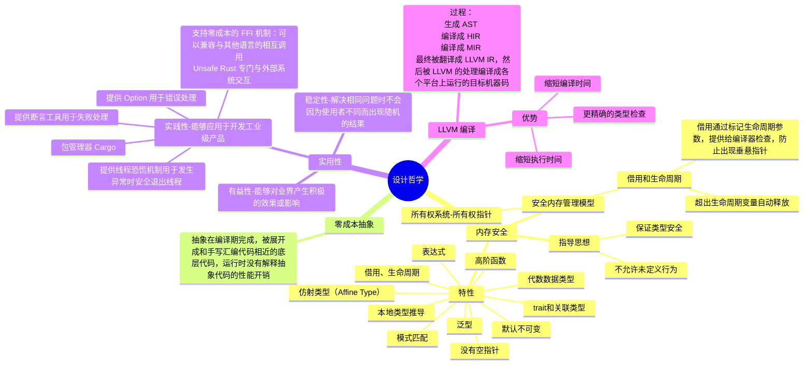

### 第二章：语言精要
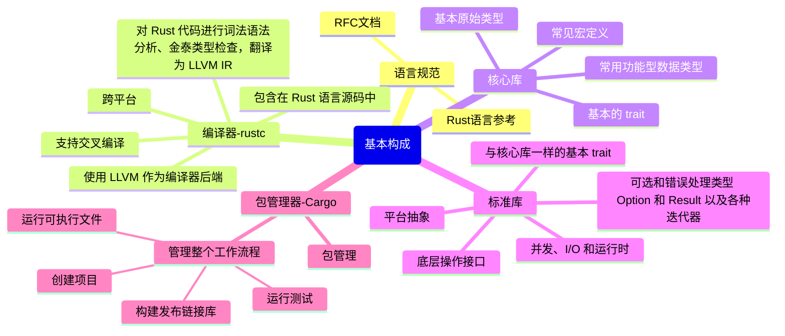

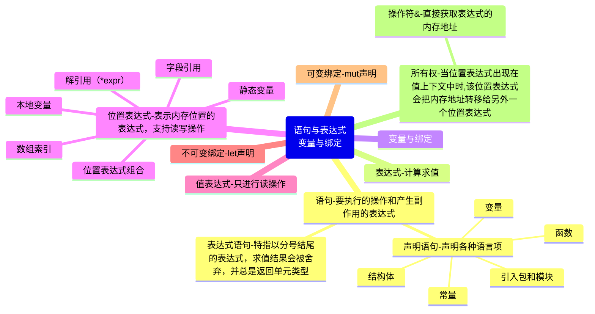

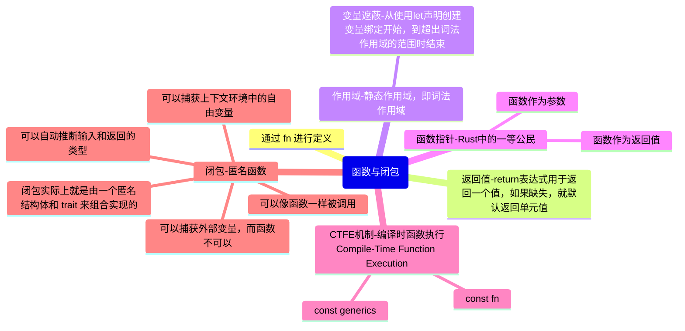

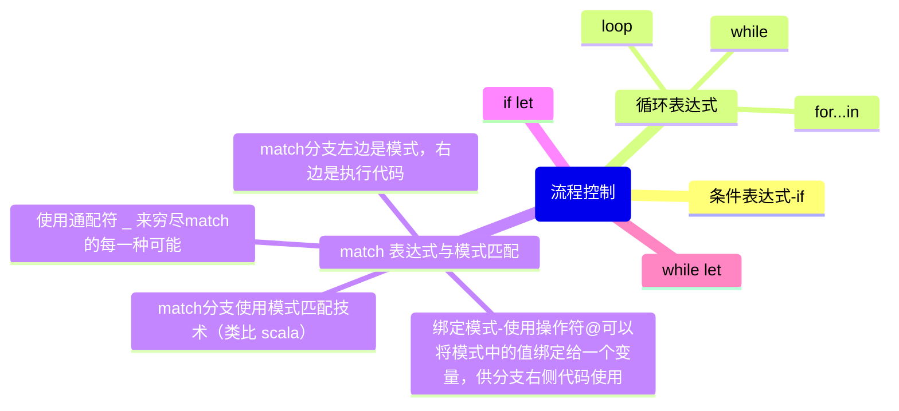

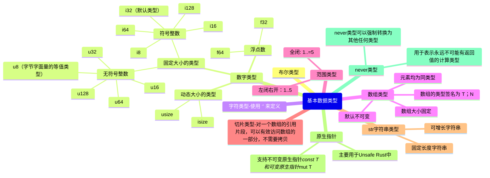

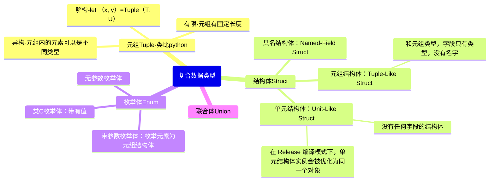

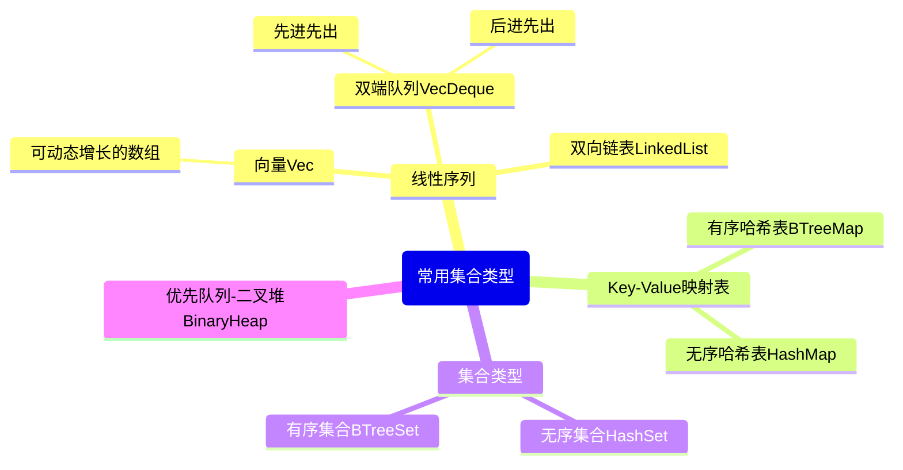

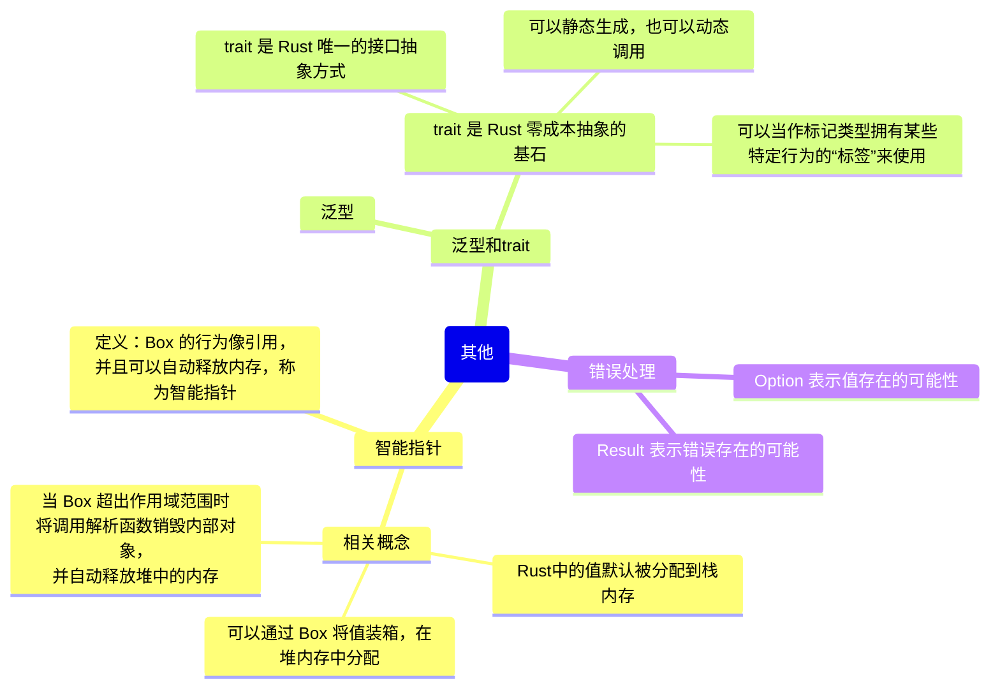

### 第三章：类型系统
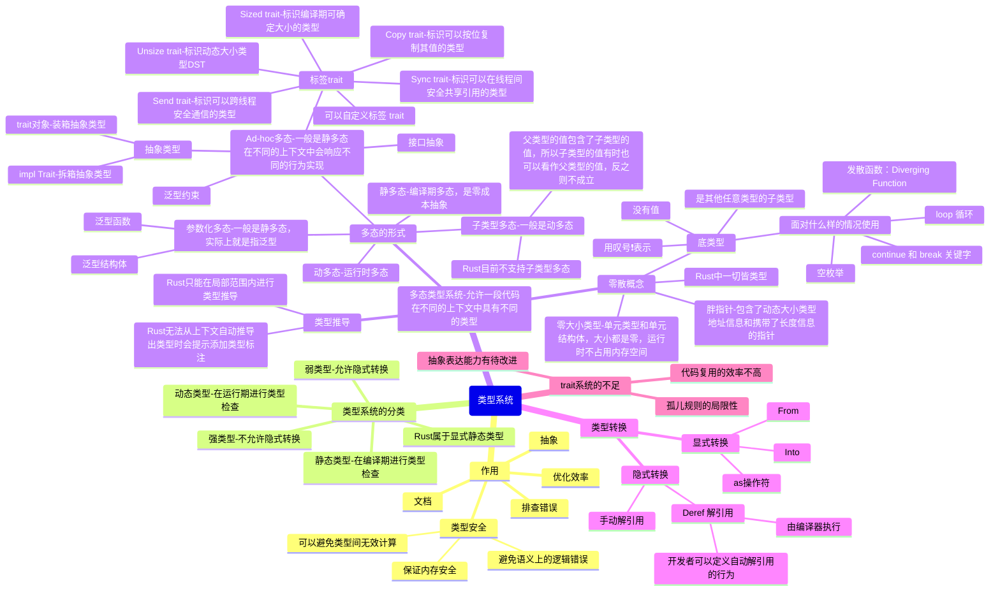

### 第四章：内存管理
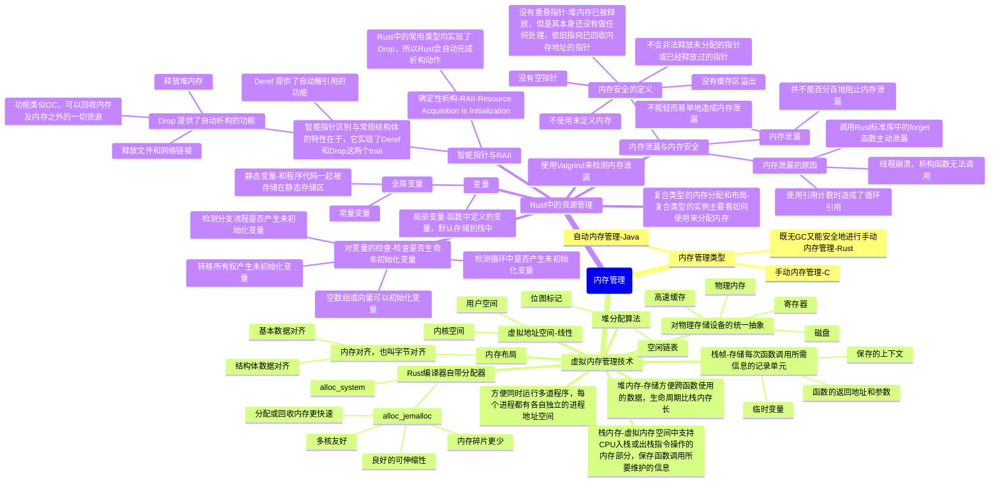

### 第五章：所有权系统
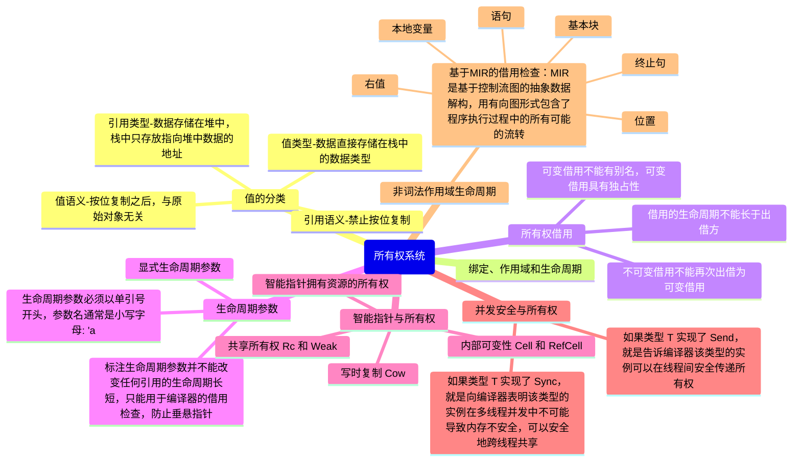

### 第六章：函数、闭包和迭代器
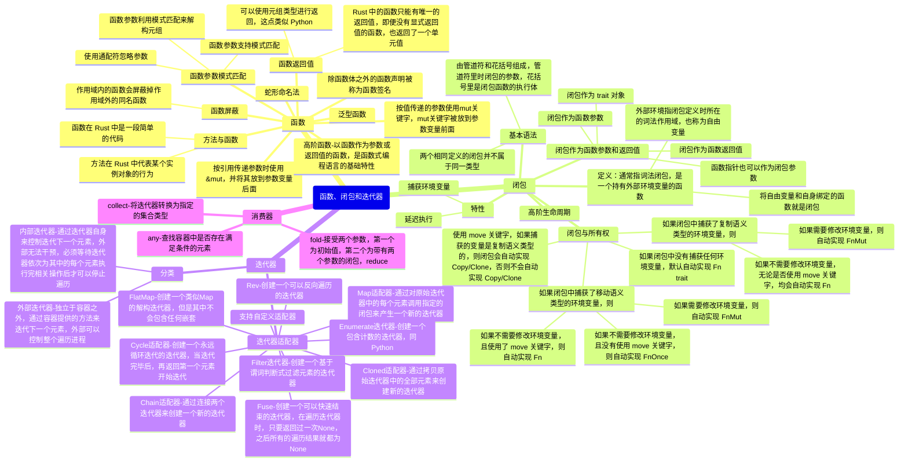

### 第七章：结构化编程
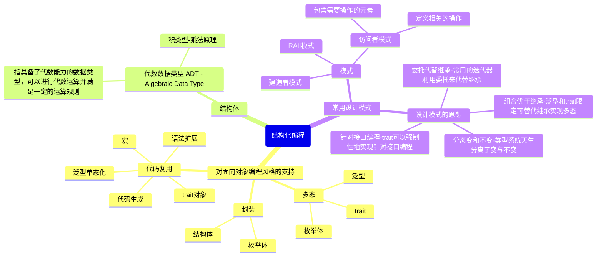

### 第八章：字符串与集合类型
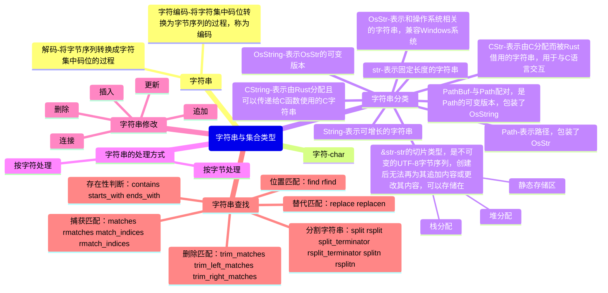

### 第九章：构建健壮的程序
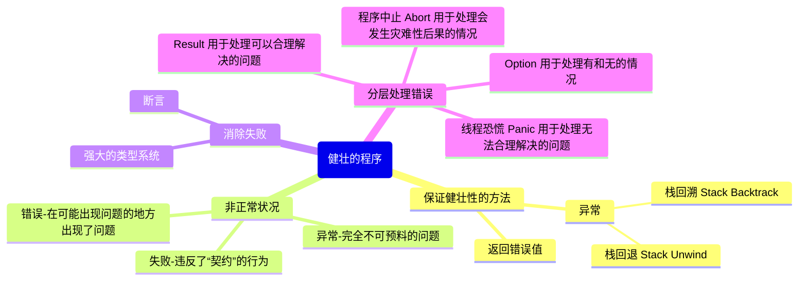

### 第十章：模块化编程
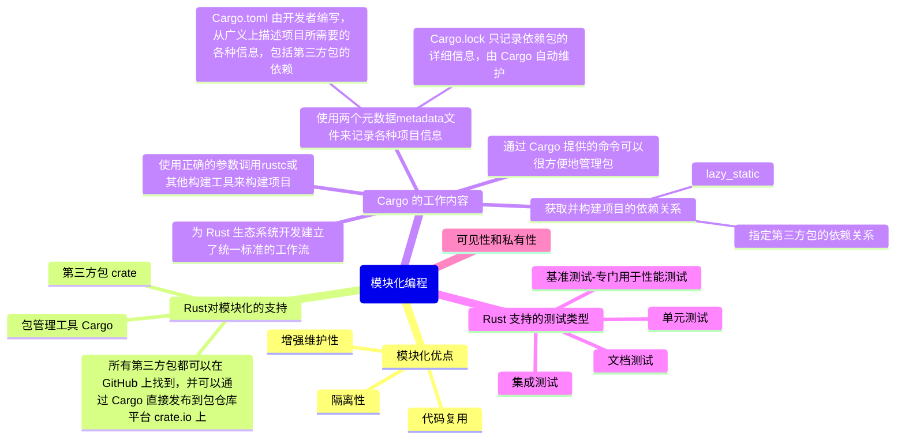

### 第十一章：安全并发
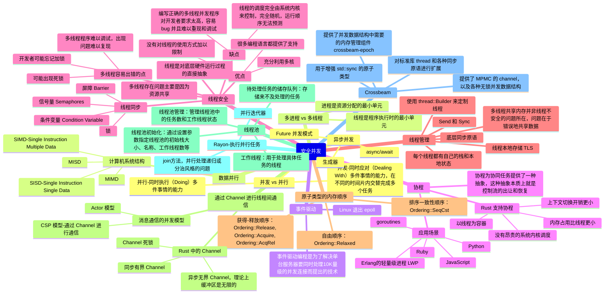

### 第十二章：元编程
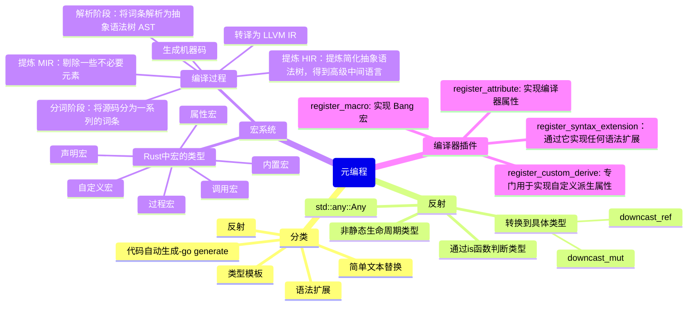

### 第十三章：超越安全的边界
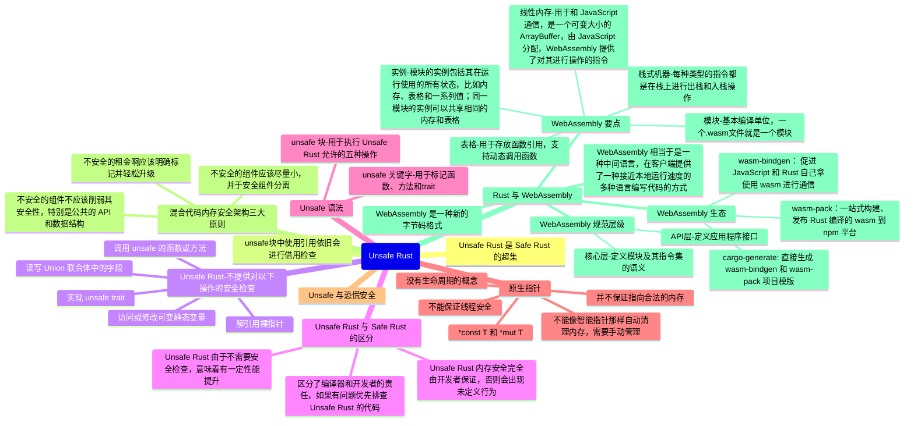