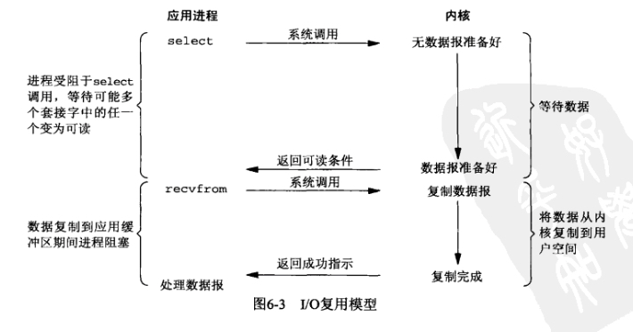

# 同步IO vs 异步IO

## 背景知识

### 用户空间 vs 内核空间
每一个用户进程会有两块空间，一块是用户空间，一块是内核空间

当用户进程需要运行某些特定指令的时候，该指令被提交到内核空间，CUP 执行内核代码完成之后，将状态返回给用户进程

### POSIX
POSIX(可移植操作系统接口)把同步IO操作定义为导致进程阻塞直到IO完成的操作，反之则是异步IO

## 阻塞IO模型

## 非阻塞IO模型

## IO复用模型

## 信号驱动IO模型

## 异步IO模型

## IO模型对比

