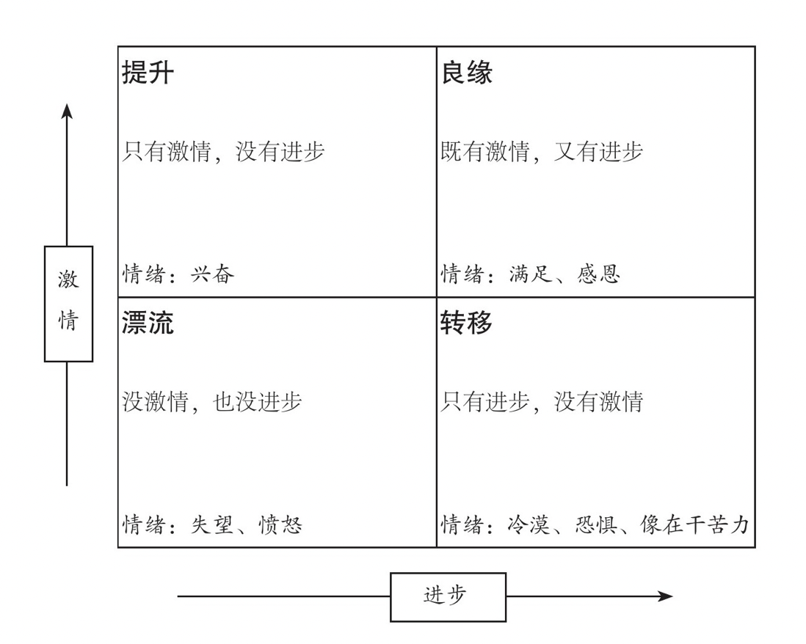
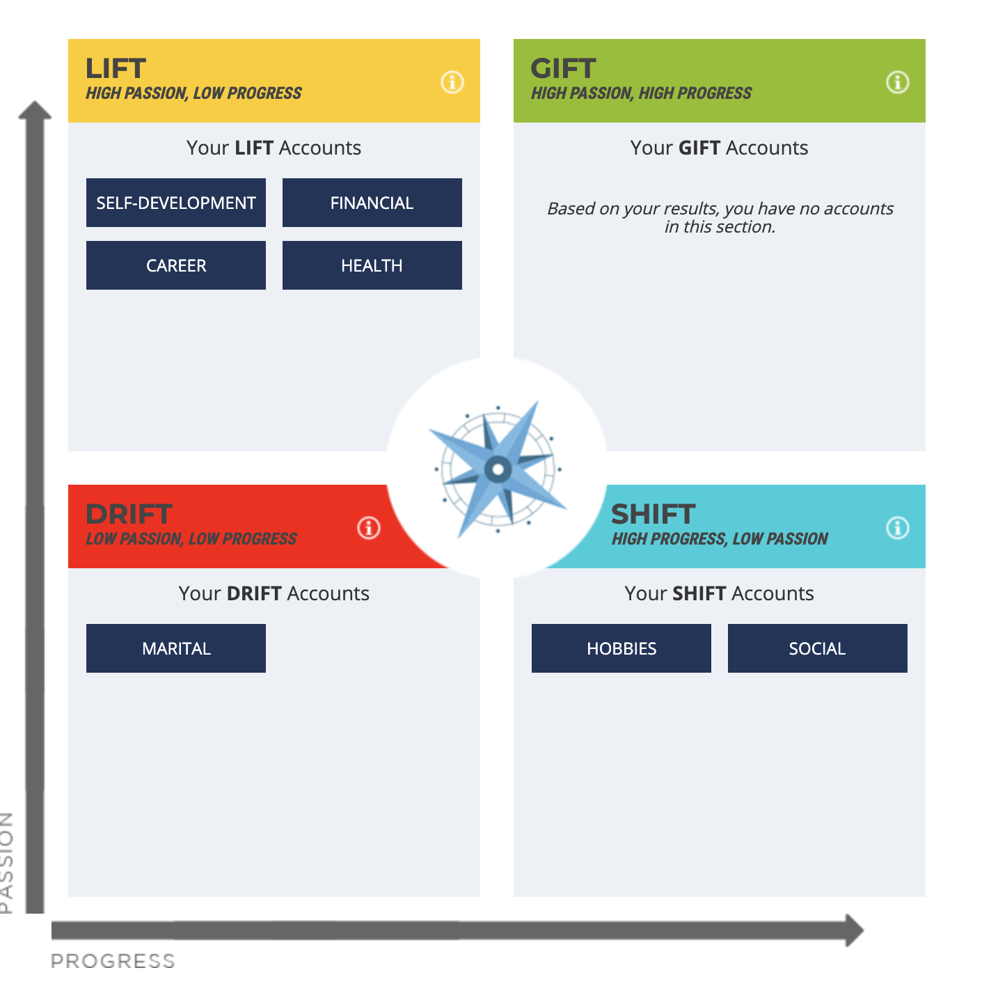

# 读书笔记:《生命向前》
作者：（美）迈克尔·海厄特　（美）丹尼尔·哈卡维
译者：陈默

约翰·C.麦克斯韦给这本书的序里写了这么一句话：「 很多人会说有人生规划很重要，但没有人真正能告诉你如何创建一份计划。现在有了。」

这句话也是我为什么要推荐这本书，并在读完这本书之后重新整理笔记的原因。

本来我是一个崇尚不读人生规划书籍的人，我觉得，只告诉我们一些大道理，但是不告诉我们如何操作，其实一点作用都没有。

但是这本书，却告诉我，该如何操作。

接下来的结构，我不想直接将书中的内容流水似的记下来，我只列举书中的关键观点，或者操作方法，给出一个梗概，具体内容还是需要看书来体会。

## 本书中的人生规划是什么？
本书中的人生规划不止包含对事业的规划，而是指对一个人的事业、家庭、健康等方方面面的规划，作者宣扬的成功人生，不止包含事业的成功，
也包含其他方面的成功：和谐的家庭关系、健康的身体等成就。

## 为什么要进行人生规划？
本书通过将无规划的人生比喻为无意义的漂流来说明，为什么需要人生规划。

无意义的漂流发生在：
* 我们对现实生活没有清醒认识，对自己的健康、婚姻、事业以及所处社会抱有不切实际的幻想的时候
* 我们的注意力被分散的时候，比如沉迷于某一方面，比如事业、游戏、爱恋、抖音等，我们认为我们当前做的事情最重要，然后忽略所有其他和生活息息相关的内容
* 我们陷入困难中并焦头烂额的时候，但是大多数情况下，解决了这个困难，可能会有其他没有注意到的困难正在等着我们
* 我们相信无法掌控现状，并接受结果的时候

无意义的漂流将会让人：
* 对现实生活产生困惑，特别是对人生意义的困惑
* 付出更多的代价去实现自己的目标，既表现在金钱上，也表现在时间上，而时间是一个人无可复制的宝贵财富
* 失去实现目标的机会
* 让人感到痛苦，而这个痛苦却是因为自己没有规划而造成的
* 在事情无可挽回时，感到遗憾，而人如果沉浸在遗憾的情绪中久久不能振作，会滚雪球似的造成更多的遗憾

而人生规划为什么能够解决无意义漂流带给人的种种问题呢？

做人生规划是制订计划并付诸实施，它能够帮助你：意识到自己当前的位置；决定想要达到的目标；开始向目标努力。

在书中，作者对人生规划的定义如下：
```
人生规划是一份简短的书面文件，通常为8到15页。它由你写出，为你而写。它描述了你想要如何被后人记住。它阐述了你个人事项的轻重缓急。
它为你人生的每个主要领域都提供了具体的行动指南，把你从现在所处的位置带到你理想的目的地。
最重要的是，这是一份有生命力的文件，在之后的人生中当你觉得有必要时可以调整。
```

那么制订这样一份人生规划，需要解决下面三个最主要的问题：
1. 我希望自己如何被他人记得？
2. 什么最重要？
3. 我怎样才能从当下到达我的目的地？

## 如何进行人生规划？

### 第一步：设计遗产
从结束的时候开始设计，所以人生规划的终极目标，就是你想留下什么样的遗产。

所以我们需要设计自己的悼念词：
1. 将自己的人际关系进行分组
2. 描述每组人际关系如何记得你

### 第二步：设计「人生账户」
确定哪些内容是自己生活中最重要的，分清主次:
1. 确定「人生账户」：家庭、朋友、事业、精神、信仰、宠物，人生账户是自己可以随意命名的、生活中在意的人或物等内容
2. 确定每个账户的情况：可以使用 [Life Assessment Profile](https://www.livingforwardassessment.com) 对账户进行评估，也可以自己经根据下图进行评估
   
   附上我个人的账号状态：
   
3. 给人生账户分出轻重缓急
4. 为每个人生账户描述目标（描述时使用确定性语言，避免使用：可能、希望等模糊字眼）
5. 为每个人生账户描述当前状态
6. 为每个人生账户作出具体承诺，该承诺必须可测量、可执行、符合实际（自己能达到）、有时间限制
7. 为每个承诺制订执行计划

在一个专注的时间内，完成自己的这个人生规划（文中建议使用一整天）

## 如何执行规划？

在执行规划之前，需要先做好心理建设，不然总会有各种让我们不开始动手做的借口：
1. 优先安排时间完成最根本的任务；消减不必要的事项；安排剩余的时间
2. 分清轻重缓急：每天、每周、每月、以及年度计划中，将最重要的放在第一位去处理
3. 学会拒绝：重视自己的利益，学会用合适的方式说不；你的时间每天只有 24 小时，当你花时间在一件事上时，势必有另一件事被推迟

在执行规划的过程中，需要通过不断阅读规划来保持活力：
1. 每天阅读规划，提醒自己需要实现的目标
2. 每周回顾规划：a. 阅读规划；b. 整理正在进行的任务，更新状态；c. 查看即将开始的任务；d. 根据当前状态制订未来一周的任务
3. 每季调整规划：回顾人生目标，为下一个季度制订承诺和执行计划
4. 每年修改规划：每年重新修改自己的人生规划计划书

本书的笔记到此整理结束，当然本书还涉及如何给公司做规划的部分，在这里不做整理，有兴趣的自行阅读。

本书附录部分有关于人生规划的制订过程以及示例等相关信息。