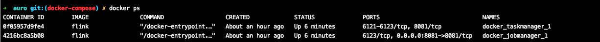

# docker compose 快速入门

### 依赖
[下载安装 docker](https://docs.docker.com/get-docker/)

### 配置
1. 在根目录下创建 docker 文件夹

2. 在 docker 目录下创建 docker/docker-compose.yml 文件

3. 使用 docker-compose -f docker/docker-compose.yml up -d 启动配置文件中的镜像
```
-f 参数指定了配置文件路径
-d 指定 docker-compose.yml 中的服务在后台执行
```

4. 使用 docker ps 即可查看到现在在后台启动的容器



